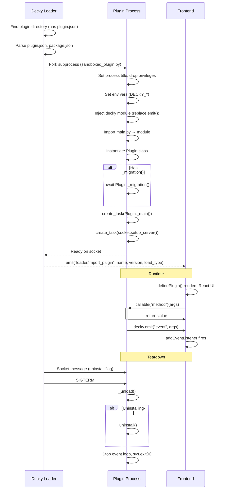

# Decky Loader Plugin Development — Complete Reference

> Compiled from official Decky Loader source code, plugin template, frontend library, and wiki.
> Source: [decky-loader](https://github.com/SteamDeckHomebrew/decky-loader), [decky-plugin-template](https://github.com/SteamDeckHomebrew/decky-plugin-template), [decky-frontend-lib](https://github.com/SteamDeckHomebrew/decky-frontend-lib)
> Date: 2026-06-01

---

## Table of Contents

- [1. Core Architecture](#1-core-architecture)
- [2. Plugin File Structure](#2-plugin-file-structure)
- [3. plugin.json Schema](#3-pluginjson-schema)
- [4. package.json](#4-packagejson)
- [5. Frontend (TypeScript/React)](#5-frontend-typescriptreact)
- [6. Python Backend](#6-python-backend)
- [7. decky Module — Python API](#7-decky-module--python-api)
- [8. @decky/api — Frontend API](#8-deckyapi--frontend-api)
- [9. @decky/ui — Frontend Components & Utilities](#9-deckyui--frontend-components--utilities)
- [10. Frontend ↔ Backend Communication](#10-frontend--backend-communication)
- [11. Socket Communication Protocol](#11-socket-communication-protocol)
- [12. Plugin Lifecycle](#12-plugin-lifecycle)
- [13. Module Patching — Injecting into Steam UI](#13-module-patching--injecting-into-steam-ui)
- [14. Build & Development Workflow](#14-build--development-workflow)
- [15. Plugin Distribution](#15-plugin-distribution)
- [16. Windows-Specific Considerations](#16-windows-specific-considerations)
- [17. Critical Gotchas](#17-critical-gotchas)
- [18. Legacy vs Modern API](#18-legacy-vs-modern-api)

---

## 1. Core Architecture

| Aspect | Detail |
|--------|--------|
| **Frontend** | TypeScript + React (JSX/TSX), compiled to `dist/index.js` via Rollup |
| **Backend** | Python 3.10+ `Plugin` class in `main.py` (async methods), runs as OS subprocess |
| **IPC** | Python ↔ TypeScript via local domain socket (Unix domain socket on Linux, named pipe / TCP on Windows) |
| **UI Injection** | `@decky/ui` patches Steam's GamepadUI React components at runtime via monkey-patching |
| **Event System** | Bidirectional: `decky.emit()` from Python → `addEventListener()` in TS; `callable()` wraps Python async methods as TS async functions |
| **Loader** | Decky Loader runs as an `aiohttp` web server on `localhost:8080`, injects the frontend bundle into Steam's GamepadUI via **Chrome DevTools Protocol** (CDP) |
| **Frontend Serving** | All `dist/*` files served via the aiohttp web server at `/plugins/{name}/dist/{path}` |
| **File Watching** | Hot reload via `watchdog` (Python) — watches `dist/index.js` and `main.py` changes |

### Process Model

```
┌─────────────────────────────────────────────┐
│  Steam Client (GamepadUI / CEF)              │
│  ┌───────────────────────────────────────┐   │
│  │  Frontend Plugin (dist/index.js)      │   │
│  │  @decky/ui components, event handlers │   │
│  └──────────────┬────────────────────────┘   │
│                 │ callable() / addEventListener│
│                 ▼                              │
│  ┌───────────────────────────────────────┐   │
│  │  Decky Loader (aiohttp web server)    │   │
│  │  localhost:8080                        │   │
│  │  - Serves frontend bundles            │   │
│  │  - Routes plugin method calls         │   │
│  │  - Manages plugin subprocesses        │   │
│  └──────────────┬────────────────────────┘   │
│                 │ local domain socket (JSON)  │
│                 ▼                              │
│  ┌───────────────────────────────────────┐   │
│  │  Plugin Backend (Python subprocess)   │   │
│  │  main.py: Plugin class                │   │
│  └───────────────────────────────────────┘   │
└─────────────────────────────────────────────┘
```

### Port Usage

- **8080**: Main aiohttp web server (Decky Loader) — serves frontend bundles, WebSocket endpoint (`/ws`), and CDP JSON endpoint
- **1337**: WebSocket/internal communication port — used by Decky's internal services; must not be occupied by other software
- Decky uses `http://localhost:8080/json` (the Chrome DevTools Protocol discovery endpoint) to enumerate CEF tabs, then injects scripts via CDP's `Page.addScriptToEvaluateOnNewDocument`

---

## 2. Plugin File Structure

### Distribution ZIP Layout

```
pluginname-v1.0.0.zip
  └── pluginname/                    # Directory name = plugin slug
      ├── dist/index.js              [REQUIRED] — Rollup-built frontend bundle
      ├── bin/                       [OPTIONAL] — Native binaries (C/C++ backends)
      ├── package.json               [REQUIRED] — npm metadata
      ├── plugin.json                [REQUIRED] — Decky manifest
      ├── main.py                    [REQUIRED if using Python backend] — Plugin class
      ├── py_modules/                [OPTIONAL] — Additional Python dependencies
      ├── dist/assets/               [OPTIONAL] — Frontend assets (images, etc.)
      ├── README.md                  [OPTIONAL]
      └── LICENSE(.md)               [REQUIRED] — License file
```

### Plugin Installation Path (Linux — Steam Deck)

| Path | Purpose |
|------|---------|
| `~/homebrew/plugins/<plugin_slug>/` | Plugin installation root |
| `~/homebrew/settings/<plugin_slug>/` | Settings / configuration data (auto-created) |
| `~/homebrew/data/<plugin_slug>/` | Runtime data (auto-created) |
| `~/homebrew/logs/<plugin_slug>/` | Log files (auto-created) |

> **Note:** `<plugin_slug>` refers to the plugin's **directory name** (the folder name inside the ZIP), not the display name from `plugin.json`. For example, a plugin with display name `"Example Plugin"` might have the directory name `decky-plugin-template`.

On Windows the base path is determined by the Decky Loader installation location (e.g. `%USERPROFILE%\homebrew\plugins\`).

---

## 3. plugin.json Schema

```json
{
  "name": "Example Plugin",
  "author": "John Doe",
  "flags": ["debug", "_root"],
  "api_version": 1,
  "publish": {
    "tags": ["template", "root"],
    "description": "Decky example plugin.",
    "image": "https://opengraph.githubassets.com/1/SteamDeckHomebrew/PluginLoader"
  }
}
```

### Fields

| Field | Type | Required | Description |
|-------|------|----------|-------------|
| `name` | string | **yes** | Display name shown in Decky menus |
| `author` | string | **yes** | Plugin author |
| `flags` | string[] | **yes** | See flags table below |
| `api_version` | int | no (default 0) | 0 = legacy kwargs, 1+ = positional args |
| `publish.tags` | string[] | no | Tags for the plugin store |
| `publish.description` | string | no | Store listing description |
| `publish.image` | string (URL) | no | Store listing image |

### Flags

| Flag | Effect |
|------|--------|
| `"debug"` | Plugin can be hot-reloaded. File watcher triggers reload on file change |
| `"_root"` | Plugin process runs as **root** user (elevated privileges). Needed for system-level access |
| `""` (none) | Plugin runs as the host user (e.g. `deck` on Steam Deck) |

---

## 4. package.json

```json
{
  "name": "decky-plugin-name",
  "version": "0.0.1",
  "type": "module",
  "scripts": {
    "build": "rollup -c",
    "watch": "rollup -c -w"
  },
  "devDependencies": {
    "@decky/rollup": "^1.0.2",
    "@decky/ui": "^4.11.4",
    "@rollup/rollup-linux-x64-musl": "^4.53.3",
    "@types/react": "19.1.1",
    "@types/react-dom": "19.1.1",
    "@types/webpack": "^5.28.5",
    "rollup": "^4.53.3",
    "typescript": "^5.6.2"
  },
  "dependencies": {
    "@decky/api": "^1.1.3",
    "react-icons": "^5.3.0",
    "tslib": "^2.7.0"
  },
  "pnpm": {
    "peerDependencyRules": {
      "ignoreMissing": [
        "react",
        "react-dom"
      ]
    }
  }
}
```

### Critical Notes

- **`"type": "module"`** is required in package.json — this enables ESMODULE_V1 load type in the loader. Without it, Legacy Eval IIFE mode is used.
- **React is NOT listed as a dependency** — it is provided at runtime by Steam's GamepadUI. Use `pnpm` with `peerDependencyRules.ignoreMissing` for `react` and `react-dom`.
- **Package manager must be `pnpm`** (not npm, not yarn) — the Decky toolchain assumes pnpm.
- **`@decky/rollup`** provides the Rollup configuration preset — no manual rollup.config needed (though you can override).

---

## 5. Frontend (TypeScript/React)

### Entry Point (`src/index.tsx`)

Every Decky plugin exports a plugin definition using `definePlugin`:

```tsx
import {
  ButtonItem,
  PanelSection,
  PanelSectionRow,
  staticClasses
} from "@decky/ui";
import {
  addEventListener,
  removeEventListener,
  definePlugin,
  toaster
} from "@decky/api";
import { FaShip } from "react-icons/fa";

function Content() {
  return (
    <PanelSection title="My Plugin">
      <PanelSectionRow>
        <ButtonItem layout="below" onClick={() => console.log("clicked")}>
          Click Me
        </ButtonItem>
      </PanelSectionRow>
    </PanelSection>
  );
}

export default definePlugin(() => {
  console.log("Plugin initializing");

  const listener = addEventListener<[message: string, success: boolean]>(
    "my_event",
    (message, success) => {
      toaster.toast({ title: "Event Received", body: `${message} - ${success}` });
    }
  );

  return {
    name: "My Plugin",
    titleView: <div className={staticClasses.Title}>My Plugin Title</div>,
    content: <Content />,
    icon: <FaShip />,
    onDismount() {
      console.log("Plugin unloading");
      removeEventListener("my_event", listener);
    },
  };
});
```

### `definePlugin()` Return Object

| Property | Type | Required | Description |
|----------|------|----------|-------------|
| `name` | string | **yes** | Plugin name shown in Decky menus |
| `content` | ReactElement | **yes** | Main plugin panel content (shown when plugin is opened) |
| `icon` | ReactElement | **yes** | Icon shown in the plugin list |
| `titleView` | ReactElement | no | Custom title bar element |
| `onDismount` | () => void | no | Cleanup function called when plugin unloads |
| `alwaysLoad` | boolean | no | Load the plugin even when its panel isn't focused |
| `defaultTab` | string | no | Default tab ID |

---

## 6. Python Backend

### `main.py` — Plugin Class Template

```python
import decky
import asyncio
import os

class Plugin:
    # Callable from TypeScript via callable<[number, number], number>("add")
    async def add(self, left: int, right: int) -> int:
        decky.logger.info(f"Adding {left} + {right}")
        return left + right

    # Callable from TypeScript via callable<[string], dict>("get_user_data")
    async def get_user_data(self, user_id: str) -> dict:
        return {"name": f"User_{user_id}", "score": 100}

    # Long-running background task that emits events to frontend
    async def long_running_task(self):
        for i in range(5):
            await asyncio.sleep(1)
            await decky.emit("progress_event", f"Step {i+1}/5", False, i+1)
        await decky.emit("progress_event", "Complete!", True, 5)

    # Called from frontend to start a background task
    async def start_background_task(self):
        self.loop.create_task(self.long_running_task())

    # ── Lifecycle Hooks ──

    async def _main(self):
        """Called once when plugin loads. Initialize resources here."""
        self.loop = asyncio.get_event_loop()
        decky.logger.info(f"Plugin loaded: {decky.DECKY_PLUGIN_NAME}")

    async def _unload(self):
        """Called when plugin is disabled or stopped. Cleanup here."""
        decky.logger.info("Plugin unloading")

    async def _uninstall(self):
        """Called when plugin is permanently uninstalled. Remove persistent data."""
        decky.logger.info("Plugin uninstalled")

    async def _migration(self):
        """Called to migrate old data to new Decky paths."""
        decky.logger.info("Running migrations")
```

### Rules for Python Backend

1. **All methods callable from frontend must be `async`**
2. **Python 3.10+ required** (as specified in decky-loader's `pyproject.toml`)
3. **Plugin runs as a separate OS process** (`multiprocessing.Process`) — not in-process
4. **Communication** is via a local domain socket (JSON lines protocol)
5. **Method names starting with `_` are private** and cannot be called from the frontend (the loader enforces this)
6. **Any async method becomes an RPC endpoint** — no decorators needed, just define the method on the `Plugin` class
7. **`api_version: 1`** in plugin.json = positional args passed to methods. `api_version: 0` or absent = legacy kwargs style
8. **Prefer `asyncio.get_running_loop()`** over `asyncio.get_event_loop()` in `_main()` and other lifecycle hooks — the latter is deprecated in Python 3.10+ when already inside a running event loop

### Python Backend Resources (Available in `py_modules/`)

Any Python packages placed in your plugin's `py_modules/` directory are automatically added to `sys.path` and importable by your `main.py`.

---

## 7. decky Module — Python API

The `decky` module is injected into plugin subprocesses by the loader's `SandboxedPlugin` class. It replaces the `emit` function with one that communicates over the local socket.

### Constants

All constants are read from environment variables set by the loader before the subprocess starts.

| Constant | Env Variable | Description |
|----------|-------------|-------------|
| `decky.HOME` | `HOME` | Home directory of effective user (`/home/deck` or `C:\Users\...`) |
| `decky.USER` | `USER` | Effective username (`deck`, `root`, or Windows username) |
| `decky.DECKY_VERSION` | `DECKY_VERSION` | Decky Loader version (e.g. `v2.5.0-pre1`) |
| `decky.DECKY_USER` | `DECKY_USER` | User where Decky resides |
| `decky.DECKY_USER_HOME` | `DECKY_USER_HOME` | Home of the Decky user |
| `decky.DECKY_HOME` | `DECKY_HOME` | Decky root folder (e.g. `/home/deck/homebrew`) |
| `decky.DECKY_PLUGIN_SETTINGS_DIR` | `DECKY_PLUGIN_SETTINGS_DIR` | **Config directory** (auto-created) |
| `decky.DECKY_PLUGIN_RUNTIME_DIR` | `DECKY_PLUGIN_RUNTIME_DIR` | **Runtime data directory** (auto-created) |
| `decky.DECKY_PLUGIN_LOG_DIR` | `DECKY_PLUGIN_LOG_DIR` | **Log directory** (auto-created) |
| `decky.DECKY_PLUGIN_DIR` | `DECKY_PLUGIN_DIR` | Plugin installation root |
| `decky.DECKY_PLUGIN_NAME` | `DECKY_PLUGIN_NAME` | From `plugin.json` |
| `decky.DECKY_PLUGIN_VERSION` | `DECKY_PLUGIN_VERSION` | From `package.json` |
| `decky.DECKY_PLUGIN_AUTHOR` | `DECKY_PLUGIN_AUTHOR` | From `plugin.json` |
| `decky.DECKY_PLUGIN_LOG` | `DECKY_PLUGIN_LOG` | Full path to the plugin's log file |

### Logger

```python
decky.logger.info("message")
decky.logger.warn("warning")
decky.logger.error("error")
```

- Writes to `DECKY_PLUGIN_LOG` (file inside `DECKY_PLUGIN_LOG_DIR`)
- Keeps last 5 log files, deletes older ones
- Also logs to stdout

### Event Emission

```python
await decky.emit(event_name: str, *args: Any) -> None
```

- Sends typed events from Python backend to TypeScript frontend
- Arguments can be any JSON-serializable type
- Received in frontend via `addEventListener`

### Migration Helpers

```python
decky.migrate_settings(*files_or_directories: str) -> dict[str, str]
decky.migrate_runtime(*files_or_directories: str) -> dict[str, str]
decky.migrate_logs(*files_or_directories: str) -> dict[str, str]
decky.migrate_any(target_dir: str, *files_or_directories: str) -> dict[str, str]
```

- Migrate legacy data files/directories to the recommended Decky paths
- Returns mapping of `old_path -> new_path`
- Automatically cleans up old locations after migration

---

## 8. @decky/api — Frontend API

> **API Version**: The latest `@decky/api` (v1.1.3) requests API version 2 from the loader. If the loader only supports version 1, the API falls back gracefully with a console warning.

```ts
import {
  definePlugin,
  callable,
  call,
  addEventListener,
  removeEventListener,
  toaster,
  routerHook,
  useQuickAccessVisible,
  openFilePicker,
  executeInTab,
  injectCssIntoTab,
  removeCssFromTab,
  fetchNoCors,
  getExternalResourceURL,
} from "@decky/api";
```

### `definePlugin(factory: () => PluginDefinition)`

Registers the plugin with Decky Loader. This is the **default export** of your `src/index.tsx`.

### `callable<Args, Return>(methodName: string)`

Creates a typed async function that calls a Python backend method.

```ts
const add = callable<[first: number, second: number], number>("add");
const result = await add(5, 3);
```

- **First generic**: Tuple of argument types
- **Second generic**: Return type
- **Throws on backend error** — wrap in try/catch

### `call<Args, Return>(methodName: string, ...args: Args): Promise<Return>`

Lower-level variant of `callable`. Calls a Python backend method directly without creating a wrapper function.

```ts
const result = await call<[number, number], number>("add", 5, 3);
```

### `addEventListener<T>(eventName: string, callback: (...args: T) => void): ListenerId`

Subscribes to events emitted from the Python backend via `decky.emit()`.

```ts
const listener = addEventListener<[message: string, isComplete: boolean]>(
  "progress_event",
  (message, isComplete) => { /* ... */ }
);
```

### `removeEventListener(eventName: string, listenerId: ListenerId): void`

Unsubscribes from events. MUST be called in `onDismount()` to prevent memory leaks.

```ts
onDismount() {
  removeEventListener("progress_event", listener);
}
```

### `toaster.toast({ title: string, body: string })`

Shows a native Steam Deck toast notification.

### `routerHook`

For adding/removing custom routes. Used for full-page plugin views:

```ts
routerHook.addRoute("/decky-plugin-test", MyPageComponent, { exact: true });
routerHook.removeRoute("/decky-plugin-test");
```

### `useQuickAccessVisible(): boolean`

React hook that returns `true` when the Quick Access Menu (QAM) is visible. Useful for pausing/resuming work when the plugin panel is hidden.

```tsx
import { useQuickAccessVisible } from "@decky/api";

function MyComponent() {
  const isVisible = useQuickAccessVisible();
  // Pause expensive operations when QAM is closed
  useEffect(() => {
    if (!isVisible) return;
    const interval = setInterval(() => doWork(), 1000);
    return () => clearInterval(interval);
  }, [isVisible]);
}
```

### `openFilePicker(...)`

Opens a native file/folder picker dialog. Returns the selected path(s).

```ts
const result = await openFilePicker(
  FileSelectionType.FILE,     // or FileSelectionType.FOLDER
  "/home/deck",               // start path
  true,                        // includeFiles
  false,                       // includeFolders
  undefined,                   // filter (RegExp or function)
  [".txt", ".json"],          // allowed extensions
  false,                       // showHiddenFiles
  true,                        // allowAllFiles
  1                            // max selections
);
// result.path — selected path (or null if cancelled)
```

### `executeInTab(tab: string, runAsync: boolean, code: string)`

Executes arbitrary JavaScript in a CEF browser tab. `tab` is the tab ID (e.g., `"Steam"`).

### `injectCssIntoTab(tab: string, css: string): string` / `removeCssFromTab(tab: string, styleId: string): void`

Injects/removes CSS into a CEF browser tab. Returns a style ID for later removal.

### `fetchNoCors(input: string, init?: DeckyRequestInit): Promise<Response>`

Performs a fetch request that bypasses CORS restrictions entirely (uses Decky's privileged loader context).

### `getExternalResourceURL(url: string): string`

Converts an external URL into a Decky-served resource URL that can bypass CORS.

---

## 9. @decky/ui — Frontend Components & Utilities

```ts
import {
  // Layout Components
  PanelSection,
  PanelSectionRow,

  // Input Components
  ButtonItem,
  ToggleField,
  SliderField,
  TextField,
  DropdownItem,

  // Navigation & Styling
  Navigation,
  staticClasses,

  // Module Patching
  findModuleExport,
  afterPatch,
  createReactTreePatcher,
  findInReactTree,
  injectFCTrampoline,

  // DOM-React Bridge
  getReactRoot,
  getReactInstance,
  getParentWindow,
  useWindowRef,

  // Utilities
  findSP,
  sleep,
  joinClassNames,
} from "@decky/ui";
```

### Layout Components

```tsx
<PanelSection title="Section Title">
  <PanelSectionRow>
    {/* Content */}
  </PanelSectionRow>
</PanelSection>
```

### Input Components

```tsx
<ToggleField label="Enable" checked={bool} onChange={setter} />

<SliderField label="Volume" value={num} min={0} max={100} onChange={setter} />

<TextField label="Name" value={str} onChange={(e) => setStr(e.target.value)} />

<ButtonItem layout="below" onClick={handler}>
  Click Me
</ButtonItem>
```

### Navigation

```tsx
Navigation.Navigate("/route");
Navigation.CloseSideMenus();
```

### staticClasses

CSS class names for native Steam styling:

```tsx
<div className={staticClasses.Title}>Title</div>
```

---

## 10. Frontend ↔ Backend Communication

There are **two protocol layers** in the communication chain:

| Layer | Protocol | Direction | Message Types |
|-------|----------|-----------|---------------|
| **Frontend ↔ Loader** | WebSocket (`/ws` on port 8080) | Bidirectional | `CALL=0`, `REPLY=1`, `ERROR=-1`, `EVENT=3` |
| **Loader ↔ Python plugin** | Local domain socket (JSON lines) | Bidirectional | `CALL=0`, `RESPONSE=1`, `EVENT=2` |

### Calling Python from TypeScript

```
TypeScript: callable<[Args], Ret>("method_name")
    ↓ (WebSocket: type=0, route="loader/call_plugin_method")
Decky Loader (WS router): resolves route → plugin process
    ↓ (Local socket: type=0, method="method_name")
Python: await Plugin.method_name(*args)
    ↓ (Local socket: type=1, success=true, res=...)
Decky Loader (WS router): relays response
    ↓ (WebSocket: type=1, result=...)
TypeScript: returns Ret (or throws on error)
```

### Events from Python to TypeScript

```
Python: await decky.emit("event_name", arg1, arg2)
    ↓ (Local socket: type=2)
Decky Loader relays to frontend
    ↓ (WebSocket: type=3)
TypeScript: addEventListener("event_name", (arg1, arg2) => { ... })
```

---

## 11. Socket Communication Protocol

JSON messages over a **local domain socket** (unix socket on Linux, named pipe or TCP on Windows).

### Message Types (IntEnum)

```python
class SocketMessageType(IntEnum):
    CALL = 0     # Method call request
    RESPONSE = 1  # Method call response
    EVENT = 2     # Event emission
```

### Method Call (TypeScript/Loader → Python plugin)

Sent from the loader (on behalf of the frontend) to the Python plugin process over the local socket:

```json
{
  "type": 0,
  "method": "method_name",
  "args": [...],
  "id": "uuid4",
  "legacy": false
}
```

### Response (Python plugin → TypeScript/Loader)

Sent back from the Python plugin after method execution completes:

```json
{
  "type": 1,
  "id": "uuid4",
  "success": true,
  "res": { ... }
}
```

### Event (Python plugin → TypeScript/Loader)

Emitted asynchronously from Python via `decky.emit()`, relayed to the frontend:

```json
{
  "type": 2,
  "event": "event_name",
  "args": [arg1, arg2, ...]
}
```

---

## 12. Plugin Lifecycle



### Lifecycle Hook Order

1. `_migration()` — data migration from legacy paths (if method exists)
2. `_main()` — resource initialization (runs as background task via `create_task`)
3. **Runtime** — methods called from frontend, events emitted, user interacts with plugin
4. `_unload()` — cleanup on plugin disable/reload/uninstall
5. `_uninstall()` — permanent cleanup, called only on actual uninstall

---

## 13. Module Patching — Injecting into Steam UI

One of Decky's most powerful features. You can patch Steam's internal React components to inject your own UI elements (e.g., adding a button to the store page).

### Finding a Steam Module

```ts
import { findModuleExport } from "@decky/ui";

const LibraryApp = findModuleExport((e) =>
  e?.toString?.()?.includes("LibraryApp")
);
```

- The predicate function fingerprints modules by their stringified code
- Returns the raw module for patching

### Patching a Component

```ts
import { afterPatch, findModuleExport } from "@decky/ui";

const TargetComponent = findModuleExport((e) =>
  e?.toString?.()?.includes("SomeUniqueString")
);

const unpatch = afterPatch(
  TargetComponent,
  "type",
  (_this: any, _ret: any) => {
    // Modify the render output
    if (_ret?.props?.children) {
      _ret.props.children.push(<button key="my-btn">My Button</button>);
    }
    return _ret;
  }
);

// On plugin unload:
unpatch.unpatch();
```

### Walking the React Render Tree

```ts
import { afterPatch, createReactTreePatcher, findModuleExport } from "@decky/ui";
import { findInReactTree } from "@decky/ui";

const LibraryApp = findModuleExport((e) =>
  e?.toString?.()?.includes("LibraryApp")
);

const unpatch = afterPatch(
  LibraryApp,
  "type",
  createReactTreePatcher(
    [
      // Step functions — find the target component in the tree
      (tree) => findInReactTree(tree,
        (node) => node?.type?.toString?.()?.includes("PlayBar")
      ),
    ],
    // Handler — modify the matched component
    ([, ret]) => {
      if (ret?.props?.children) {
        ret.props.children.push(<button key="my-btn">My Action</button>);
      }
      return ret;
    },
    "LibraryApp:PlayBar" // Debug label
  )
);
```

### Function Component Trampoline

For hook components, wrap them in a class-like wrapper:

```ts
import { injectFCTrampoline, findModuleExport } from "@decky/ui";

const Target = findModuleExport((e) => e?.toString?.()?.includes("..."));
const trampoline = injectFCTrampoline(Target);
const original = trampoline.component;

trampoline.component = function(props: any) {
  const result = original.call(this, props);
  return <>{result}<div>Injected</div></>;
};

// Restore on unload:
// trampoline.component = original;
```

### DOM-React Bridge

```ts
import { getReactRoot, getReactInstance, getParentWindow, useWindowRef } from "@decky/ui";

// From a DOM element, get its React fiber
const fiber = getReactInstance(document.querySelector(".SomeClass")!);

// Get the hosting window (multi-window GamepadUI)
const hostWindow = getParentWindow(element);

// React hook for window reference
function MyComponent() {
  const [ref, win] = useWindowRef<HTMLDivElement>();
  // win is the Window object hosting this component
  return <div ref={ref}>Content</div>;
}
```

### Steam API Types

`@decky/ui` provides TypeScript type declarations for the `SteamClient` API, giving intellisense when working with Steam's internal APIs:

- `SteamClient.Storage` — key-value storage
- `SteamClient.Apps` — app/game management
- `SteamClient.Overlay` — overlay controls
- `SteamClient.User` — user/profile data

---

## 14. Build & Development Workflow

### Initial Setup

```bash
# Install dependencies
pnpm i

# Build frontend for production
pnpm run build

# Watch mode for development
pnpm run watch
```

### Build Toolchain

| Tool | Purpose |
|------|---------|
| **Rollup** | Module bundler |
| **@decky/rollup** | Pre-configured Rollup setup for Decky plugins |
| **TypeScript** | Type checking and compilation |
| **@decky/ui** | Steam-native React components (resolved dynamically at runtime) |
| **@decky/api** | Core plugin API (definePlugin, callable, events) |

### Important

- `pnpm` is required (not npm/yarn) — the `@decky/rollup` package assumes pnpm
- The `@decky/ui` and `@decky/api` packages are dynamically resolved at runtime from the Steam client's module cache — they are build-time type definitions, not runtime bundles
- `@rollup/rollup-linux-x64-musl` may need to be replaced for non-Linux builds (Windows: `@rollup/rollup-win32-x64-msvc`)

### Deploying to Steam Deck (Linux Dev)

```bash
# Using VS Code tasks or deck.sh script
# Build, deploy, and reload each time
pnpm run build
# Copy to ~/homebrew/plugins/<name>/
# Reload Decky (Settings → Reload plugins or restart)
```

---

## 15. Plugin Distribution

### Manual Packaging

Create a ZIP file with the structure shown in [Section 2](#2-plugin-file-structure).

### Decky Plugin Store

Submit to [decky-plugin-database](https://github.com/SteamDeckHomebrew/decky-plugin-database) for inclusion in the Decky plugin store.

### URL Install

Users can install from any URL via Decky's Settings → Install from URL. The URL must point to a valid plugin ZIP.

---

## 16. Windows-Specific Considerations

### Current Status

Decky Loader is **officially a Steam Deck (SteamOS/Linux) project**. However:

1. **The README explicitly mentions**: "You can also install the Steam Deck UI on a Windows or Linux computer for testing by following [this YouTube guide](https://youtu.be/1IAbZte8e7E?t=112)."
2. There is **no official Windows Decky Loader** — but the architecture supports it.
3. The community has forks/efforts to make Decky run on Windows.

### What Works Cross-Platform

- **aiohttp web server** (cross-platform Python)
- **Chrome DevTools Protocol** injection (`localhost:8080/json` — works on any platform with CEF/Chrome)
- **Local sockets** — Windows supports named pipes and TCP sockets (fallback from Unix domain sockets)
- **`multiprocessing.Process`** — works on Windows (creates child processes)

### What Fails on Windows (in sandboxed_plugin.py)

The following operations in `decky-loader`'s `sandboxed_plugin.py` are **Linux-specific**:

1. `setproctitle(self.name)` — sets the process title (Linux-only, fails gracefully on other platforms)
2. `setthreadtitle(self.name)` — same
3. `loop.add_signal_handler(SIGINT, ...)` — POSIX signals, use `try/except` or platform check
4. `loop.add_signal_handler(SIGTERM, ...)` — same
5. `setgid(UserType.EFFECTIVE_USER)` — Unix group ID change (Windows-only builds don't need this)
6. `setuid(UserType.EFFECTIVE_USER)` — Unix user ID change (same)

The plugin template already has:
```python
if ON_LINUX:
    loop.add_signal_handler(SIGINT, lambda: ensure_future(self.shutdown()))
    loop.add_signal_handler(SIGTERM, lambda: ensure_future(self.shutdown()))
```

### Windows Paths

On Windows, the default Decky paths (`/home/deck/homebrew/...`) would become:
```
%USERPROFILE%\homebrew\plugins\<name>\
%USERPROFILE%\homebrew\settings\<name>\
%USERPROFILE%\homebrew\data\<name>\
%USERPROFILE%\homebrew\logs\<name>\
```

Or wherever Decky Loader is installed. These environment variables (`DECKY_HOME`, etc.) are set by the loader at subprocess spawn.

### Python on Windows

- Python 3.10+ must be installed and accessible to Decky Loader
- The `py_modules/` directory works identically on Windows
- `httpx` (commonly used for HTTP in plugins) works cross-platform

---

## 17. Critical Gotchas

### 17.1 No Direct DOM Manipulation

**Millennium** allows direct DOM queries (`document.querySelector`, `MutationObserver`). **Decky** works by patching React components. You cannot reliably use `document.querySelector` to find Steam UI elements because:

- The React tree may not be reflected in the DOM
- Steam's component tree changes between updates
- The proper Decky way is `findModuleExport` + `afterPatch` + `createReactTreePatcher`

### 17.2 Event Listener Cleanup

All event listeners added with `addEventListener()` MUST be removed in `onDismount()`. Failure to do so causes:
- Memory leaks
- Duplicate event handling
- Crashes when the plugin is reloaded

```ts
// ✅ Correct
const listener = addEventListener("event", handler);
return {
  /* ... */
  onDismount() {
    removeEventListener("event", listener);
  },
};
```

### 17.3 Python Method Arguments (api_version)

**With `api_version: 1`** (positional args):
```python
async def my_method(self, arg1: str, arg2: int) -> dict:
```
```ts
const myMethod = callable<[arg1: string, arg2: number], dict>("my_method");
await myMethod("hello", 42);
```

**With `api_version: 0` or missing** (legacy kwargs):
```python
# Note: method receives self explicitly
async def my_method(self, arg1: str, arg2: int) -> dict:
```
```ts
const myMethod = callable<[kwargs: {arg1: string, arg2: number}], dict>("my_method");
await myMethod({arg1: "hello", arg2: 42});
```

### 17.4 Frontend State Between Reloads

When a plugin is reloaded, React state is lost. Use `decky` environment variables or Python backend storage for persistent state.

### 17.5 CORS is Handled

Decky plugins can make fetch requests without CORS issues because they run in Steam's GamepadUI context, which has elevated privileges. Additionally:
- Use `fetchNoCors()` from `@decky/api` for CORS-free requests via Decky's loader context
- The Python backend can proxy API calls through the local socket connection

### 17.6 Plugin is "Passive" Without main.py

If `main.py` does not exist, the plugin is considered **passive** (frontend-only). The `callable()` function will throw if you try to call backend methods on a passive plugin.

### 17.7 No `_` Methods Exposed

Any Python method starting with `_` (underscore) is **private** and cannot be called from the frontend. The loader enforces this check at runtime.

### 17.8 The `decky` Module vs `decky_plugin`

```python
import decky
# is equivalent to:
import decky_plugin
```

Both modules are the same object. `decky_plugin` is provided for backward compatibility with older plugin code. Prefer `import decky`.

---

## 18. Legacy vs Modern API

| Aspect | Modern (`api_version >= 1`) | Legacy (`api_version: 0` or absent) |
|--------|----------------------------|-------------------------------------|
| **Method call style** | `await method(arg1, arg2)` — positional args | `await method(**kwargs)` — keyword args, with the **class** passed as `self` |
| **Plugin class** | `Plugin()` — instance created once by loader | `Plugin` — class reference, methods receive the class (not an instance) as first arg |
| **Lifecycle hooks** | `self._main()` — `self` is the instance | `self._main(self)` — `self` is the **class**, first arg is the class again |
| **Socket args format** | `args: [...]` array | `args: {...}` kwargs object |
| **Legacy warning** | N/A | Loader logs: "using legacy method calls" |

Always use `api_version: 1` for new plugins.

---

> **Next Steps**: See the project analysis and source code at `D:\Git\Decky-STPlugin\` to understand the existing Millennium plugin that needs to be ported. Refer to the brainstorming skill (`docs/superpowers/specs/`) for the design workflow.
